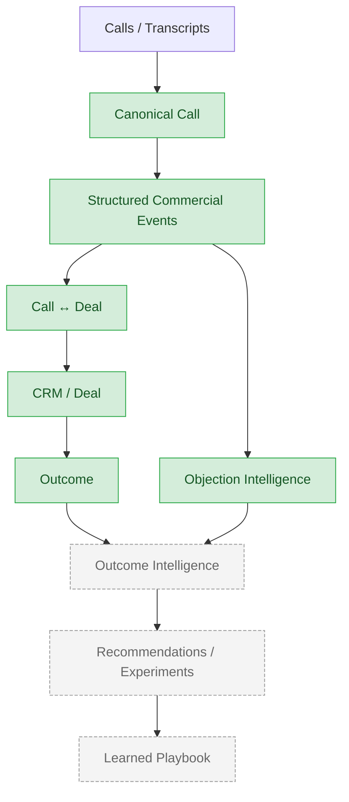

# AI Closer

Outcome-linked Sales Intelligence for high-ticket sales operations.

[](https://github.com/mori-mkm/closer-ai/actions/workflows/ci.yml)


AI Closer transforms sales conversations into structured commercial evidence, connects that
evidence to CRM deals, and learns which behaviors and strategies are associated with better
outcomes.

The goal is not to build an AI that tells salespeople how to sell. The goal is to build a
system that continuously discovers how a specific sales operation sells better.

```
Calls / Transcripts
        ↓
Structured Commercial Events
        ↓
CRM / Deal
        ↓
Outcome
        ↓
Objection + Outcome Intelligence
        ↓
Recommendations / Experiments
        ↓
Learned Playbook
```

## Why AI Closer

This is not a call summarizer, a sales chatbot, an "AI coach," or a closer leaderboard.

Summaries lose the structure that matters. Coaching tips without evidence are opinions. Ranking
closers with a handful of people per operation is a statistically unsupported conclusion. AI
Closer instead treats every call as evidence for a commercial hypothesis, ties that evidence to
a real deal, and measures what actually correlates with winning — for one operation at a time,
not a generic "best practices" list.

## Product thesis

The commercial unit of analysis is the **Deal**, not the call. A deal can span multiple calls,
so a call's outcome is never the deal's outcome:

```
Call outcome != Deal outcome
```

This is enforced in the domain model, not just a convention: `Call` has no outcome field at
all, and `Deal.outcome` has no default — every caller must state it explicitly.

## Architecture



Green = implemented in code today (contracts, tests, and — for the Agro slice — a working
parser against synthetic data). Gray/dashed = designed for, not built yet. Full model:
[`docs/architecture/DATA_MODEL.md`](docs/architecture/DATA_MODEL.md).

## What is implemented

- Canonical `Call` model — `Participant`, `TranscriptSegment`, deterministic IDs
- Agro source-boundary normalization (`raw → AgroRawCall → Call`), validated against synthetic
  data only
- Participant/speaker quality flags (missing transcript, unresolved speaker, duration
  mismatch, participant ID collisions, and others)
- Conservative unresolved-lead handling — lead identity is never inferred from participant
  count or exclusion; an `unresolved_lead` flag surfaces the gap instead
- `ObjectionEvent` v0 contract + a deterministic rule-based extractor (`RuleBasedObjectionExtractor`)
- A synthetic evaluation baseline (schema validity, evidence grounding, precision/recall)
- `Lead`, `Deal`, `StageEvent` domain model with an explicit `DealOutcome`
- `Call ↔ Deal` association contract (`CallDealMatch`, `MatchEvidence`) and one deterministic
  matcher (`ExactExternalIdMatcher`)
- GitHub Actions CI (import check, lint, tests) on every pull request and push to `main`
- A multi-agent development workflow (Domain Agent / AI Engineer / Evaluator / Reviewer)
- Real-data onboarding and privacy protocols, written before any real data was received

Nothing here is described as production-ready — see "Current development status" below.

## Current development status

```
Implemented
✅ Canonical Call
✅ Deal-level domain model (Lead, Deal, StageEvent, DealOutcome)
✅ Objection Intelligence v0 (contract + rule-based baseline)
✅ Agro ingestion — synthetic vertical slice
✅ Call ↔ Deal foundation (contract + exact-ID matcher)
✅ CI (GitHub Actions)
✅ Real-data onboarding & privacy protocols
✅ Unresolved-lead observability (no silent zero-objection failure)

In validation / design
🟡 Objection taxonomy v1 and annotation guidelines
🟡 Real golden-set sampling strategy (defined, not yet applied)
🟡 LLM extractor architecture (not started)

Blocked on real data
🔒 Agro source format validation (108-call corpus, not accessed yet)
🔒 Empreende Brazil source validation (35-call corpus, not accessed yet)
🔒 Real golden set (needs real calls + annotators)
🔒 CRM (Kommo) adapter
🔒 Real Call ↔ Deal matching
🔒 Outcome Intelligence
```

Full detail: [`docs/context/CURRENT_STATE.md`](docs/context/CURRENT_STATE.md),
[`docs/context/EXECUTION_GATES.md`](docs/context/EXECUTION_GATES.md).

## Core domain model

```
Lead
  ↓
Deal
  ├── StageEvent[]        (append-only stage history)
  ├── DealOutcome          (open / won / lost / unknown — lives only on Deal)
  └── CallDealMatch[]      → Call
                              └── ObjectionEvent[]
```

Deal is the commercial unit; a call never carries an outcome of its own. `Call` and `Deal` are
never nested — the link is always through `CallDealMatch`, which records the method, confidence,
and evidence behind a match, never a single silently-chosen winner. An ambiguous match produces
multiple `CallDealMatch` rows, not one row with the losing candidates discarded. Contract:
[`docs/domain/DEAL_MODEL.md`](docs/domain/DEAL_MODEL.md).

## Objection Intelligence

`ObjectionEvent` v0 is implemented: a closed taxonomy (`price`, `timing_priority`,
`trust_authority`, `no_need`, `other`), evidence grounded to a single transcript segment, and
deterministic IDs for idempotent re-extraction. The current extractor
(`RuleBasedObjectionExtractor`) is a Portuguese keyword matcher — a deterministic v0 baseline,
**not** the intended LLM-based extractor, and evaluated only against a small synthetic golden
set (see below). Evidence grounding is part of the contract: every emitted event's segment must
resolve to a real segment spoken by a participant with a resolved lead role. Contract:
[`docs/domain/OBJECTION_MODEL.md`](docs/domain/OBJECTION_MODEL.md).

## Evaluation methodology

Quality is measured against annotated evidence, not "the prompt looks good":

```
Taxonomy
    ↓
Annotation Guidelines
    ↓
Golden Set
    ↓
Double Annotation
    ↓
Human Agreement
    ↓
Extractor
    ↓
Evals
    ↓
Error Analysis
    ↓
Batch
```

Today only the first and last-but-two steps have real implementation: a v0 taxonomy exists, and
`evals/objection_v0/` runs schema-validity, grounding, and precision/recall against a **9-example
synthetic golden set** — useful as a regression harness, not evidence the extractor works on real
calls. A real golden set (double-annotated, agreement measured) is planned but not built.
Sampling strategy: [`docs/evals/GOLDEN_SET_SAMPLING.md`](docs/evals/GOLDEN_SET_SAMPLING.md).

## Repository structure

```
src/closer_ai/
├── normalization/   # Canonical Call, Participant, TranscriptSegment, deterministic IDs
├── ingestion/
│   └── agro/        # Agro/Zoom source-boundary parser (synthetic-validated)
├── domain/          # Lead, Deal, StageEvent, CallDealMatch, ObjectionEvent
├── ai/               # ObjectionExtractor (rule-based baseline)
├── analytics/         # reserved — no implementation yet
├── experiments/        # reserved — no implementation yet
├── storage/             # reserved — no implementation yet
├── api/                  # reserved — no implementation yet
└── integrations/          # reserved — no implementation yet

tests/    # unit + integration tests (220 at the time of this README)
evals/    # synthetic evaluation harness (objection_v0)
docs/     # architecture, domain contracts, data protocols, agent workflow
data/     # local-only staging for real data (gitignored) — never committed
```

## Quickstart

```bash
git clone https://github.com/mori-mkm/closer-ai.git
cd closer-ai

python -m venv .venv

# Windows
.venv\Scripts\activate
# macOS/Linux
source .venv/bin/activate

pip install -e ".[dev]"

pytest -q
ruff check .
```

No Docker, no database, no external service — the test suite is fully hermetic.

## Tests and CI

220 automated tests at the time of this README update (`pytest -q`). CI runs on every pull
request and push to `main`: a package import sanity check, `ruff check .`, and `pytest -q`.
Workflow: [`.github/workflows/ci.yml`](.github/workflows/ci.yml).

## Data and privacy

This is a **public** repository. Real customer data — transcripts, recordings, CRM exports,
names, emails, phone numbers, secrets, or private notes — is never committed. All fixtures under
`tests/fixtures/` and `evals/datasets/` are synthetic. Full policy:
[`docs/data/PRIVACY_BOUNDARY.md`](docs/data/PRIVACY_BOUNDARY.md).

When a real-world edge case is found, it doesn't get copied in with names swapped — text can
carry indirect PII even after redaction. The process is: understand the structural behavior →
recreate a synthetic equivalent → verify no PII → commit the synthetic reproduction.

The project is preparing to validate its contracts against partner call and CRM data (known
corpora: an Agro/BeefPoint set and an Empreende Brazil set). None of that raw data lives in this
repository — access and authorization are handled outside of it, and source formats are still
being validated, not assumed. See [`docs/data/`](docs/data/) for the onboarding protocol.

## Roadmap

```
1. Validate source contracts against real calls
2. Define objection_episode v1 + annotation guidelines
3. Build and adjudicate a real golden set
4. Implement and evaluate an LLM-based extractor
5. Validate real Call ↔ Deal linkage
6. Build Outcome Intelligence
```

A FastAPI service, dashboard, realtime copilot, and production database are later-stage
productization concerns, not on the current critical path. Full sequencing:
[`docs/product/ROADMAP.md`](docs/product/ROADMAP.md).

### Explicitly not implemented

A production application, a live copilot, a batch run over real data, a validated LLM
extractor, a production database, a dashboard, and Outcome Intelligence validated against real
CRM data. All of the above are designed for, none are built.

## Contributing / Development workflow

One task, one owner, one branch — one worktree when work runs in parallel. Architecture, schema,
and merge decisions stay human-reviewed; agents never merge their own work. Details:
[`AGENTS.md`](AGENTS.md), [`CLAUDE.md`](CLAUDE.md),
[`docs/agents/WORKFLOW.md`](docs/agents/WORKFLOW.md),
[`docs/agents/TEAM_ORCHESTRATION.md`](docs/agents/TEAM_ORCHESTRATION.md).

## Documentation

- [`docs/context/CURRENT_STATE.md`](docs/context/CURRENT_STATE.md) — operational snapshot
- [`docs/architecture/`](docs/architecture/) — data model, integrations
- [`docs/domain/`](docs/domain/) — Deal, Objection, Agro ingestion contracts
- [`docs/data/`](docs/data/) — real-data onboarding, privacy, quality protocols
- [`docs/product/`](docs/product/) — MVP scope, roadmap
- [`docs/agents/`](docs/agents/) — multi-agent development workflow
